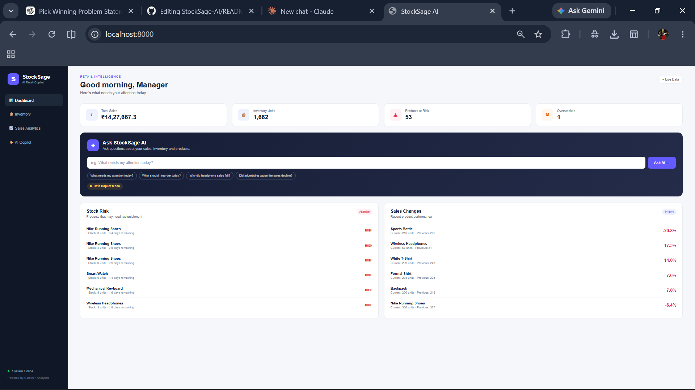
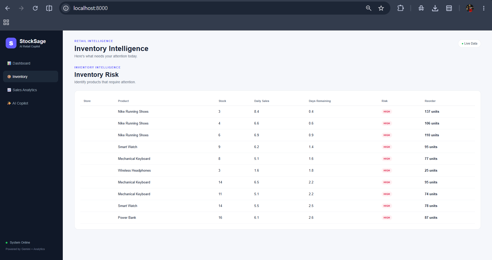
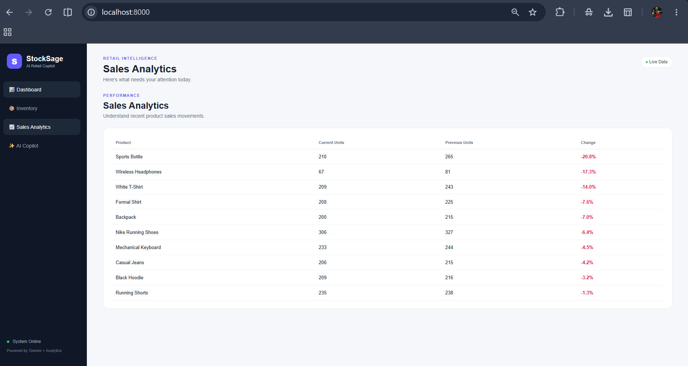
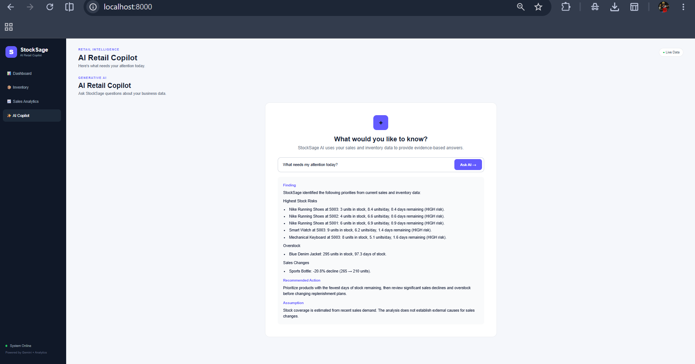

TRACK_ID=PS03

# StockSage AI

### Smart Retail Decisions, Powered by AI

StockSage AI is an AI-powered retail sales and inventory copilot
designed for small retail operations. It helps store managers quickly
identify what needs attention by analyzing sales, inventory, product,
and store data.

## 🖥️ Application Screenshots

### Dashboard


### Inventory Risk


### Sales Analytics


### AI Retail Copilot


## 🚀 Features

-   💬 Natural-language AI retail copilot
-   📦 Stock-out risk detection
-   🔄 Reorder recommendations
-   📊 Sales increase and decline analysis
-   📈 Sales trend insights
-   🐢 Slow-moving and overstock detection
-   ⚡ Priority-based attention summary
-   🎯 Evidence-backed recommendations
-   🔢 Answers supported by actual sales and inventory figures
-   🛡️ Data-grounded responses with limitations
-   🤖 Gemini-powered explanations with deterministic Python analytics

## 🧠 How It Works

StockSage AI uses an evidence-first architecture.

1.  Retail data is loaded from CSV files.
2.  Python analytics performs deterministic calculations.
3.  Relevant facts are selected based on the manager's question.
4.  Gemini receives the question together with the calculated facts.
5.  Gemini explains the results in a concise manager-friendly format.
6.  If the available data cannot answer a question, the system clearly
    states that instead of guessing.

The system separates deterministic business calculations from LLM
reasoning to keep answers grounded in actual data.

## 📊 Data

The application works with:

-   Products
-   Stores
-   Daily sales
-   Current inventory
-   Reorder levels

The dataset includes multiple stores, products, inventory quantities,
sales transactions, and product-level information.

## 💬 Example Questions

Managers can ask questions such as:

-   What needs my attention today?
-   What should I reorder today?
-   Which products are running out?
-   Which products are overstocked?
-   How did Wireless Headphones perform?
-   Which products had the biggest sales decline?
-   Which products have unusual sales changes?
-   Did advertising cause the sales decline?

For questions requiring unavailable information, StockSage AI does not
guess. It clearly communicates the limitation.

## 🛡️ Evidence-Based AI

StockSage AI is designed to provide grounded business decisions.

The AI is instructed to:

-   Use only supplied data.
-   Never invent sales or inventory figures.
-   Distinguish facts from recommendations.
-   Support recommendations with actual numbers.
-   State assumptions and limitations.
-   Avoid unsupported causal claims.
-   Clearly indicate when the available data is insufficient.

For example, the system can identify a sales decline but will not claim
that advertising caused the decline unless advertising data is
available.

## 📈 Key Analytics

### Stock-Out Risk

Identifies store-product combinations that may run out soon using:

-   Current inventory
-   Recent average daily sales
-   Estimated days of stock remaining
-   Risk level

### Overstock Detection

Identifies products with unusually high inventory coverage using:

-   Current stock
-   Recent sales velocity
-   Estimated days of stock

### Sales Change Analysis

Compares recent sales with the previous period to identify:

-   Sales increases
-   Sales declines
-   Significant changes
-   Products requiring investigation

### Attention Summary

Combines important signals into a manager-focused view showing:

-   High-priority stock risks
-   Overstocked products
-   Significant sales declines
-   Recommended areas of attention

## 🏗️ Project Structure

``` text
StockSage-AI/
├── data/
│   ├── inventory.csv
│   ├── products.csv
│   ├── sales.csv
│   └── stores.csv
├── frontend/
│   ├── app.js
│   ├── index.html
│   └── style.css
├── src/
│   ├── analytics.py
│   ├── copilot.py
│   ├── database.py
│   ├── generate_data.py
│   └── prompts.py
├── screenshots/
|   ├── dashboard.png
|   ├── inventory-risk.png
|   ├── sales-analytics.png
|   └── ai-copilot.png
├── app.py
├── README.md
└── requirements.txt
```

## 🛠️ Technology Stack

-   Python 3.11
-   FastAPI
-   Pandas
-   Google Gemini API
-   HTML
-   CSS
-   JavaScript
-   CSV-based retail dataset

## ⚙️ Installation

### 1. Clone the Repository

``` bash
git clone https://github.com/SkMdJakeer/StockSage-AI.git
cd StockSage-AI
```

### 2. Create Virtual Environment

``` bash
python -m venv .venv
```

### 3. Activate Virtual Environment

Windows:

``` bash
.venv\Scripts\activate
```

### 4. Install Dependencies

``` bash
pip install -r requirements.txt
```

### 5. Configure Gemini API

Create a `.env` file in the project root:

``` env
GEMINI_API_KEY=your_api_key_here
```

Never commit your API key to GitHub.

### 6. Run the Application

``` bash
python app.py
```

Open the application at:

``` text
http://localhost:8000
```

## 🔐 Security

Sensitive configuration is excluded from version control.

The `.gitignore` file excludes:

-   `.env`
-   `.venv`
-   Python cache files
-   VS Code configuration

API keys should always be stored in environment variables.

## 🎯 Problem Statement

**PS03 --- Retail - Sales and Inventory Copilot**

StockSage AI helps a store manager quickly understand what needs
attention across sales and inventory data. It identifies likely
stock-outs, overstocked and slow-moving products, unusual sales changes,
and provides evidence-backed recommendations.

When the available data cannot support an answer, StockSage AI clearly
communicates the limitation rather than guessing.

## 🌟 Why StockSage AI

StockSage AI focuses on practical retail decision-making rather than
simply generating text.

Its core approach is:

**Data → Deterministic Analytics → Evidence → AI Explanation → Action**

This allows managers to move from raw retail data to actionable
decisions quickly while keeping recommendations grounded in measurable
business information.

## 👨‍💻 Author

**Shaik Mohammad Jakeer**

GitHub: https://github.com/SkMdJakeer

## 🏆 Hackathon

Built for the **NexusTiQ24 GenAI Hackathon**.

Track: **PS03 --- Retail - Sales and Inventory Copilot**

## 📄 License

This project was developed for the NexusTiQ24 hackathon.
